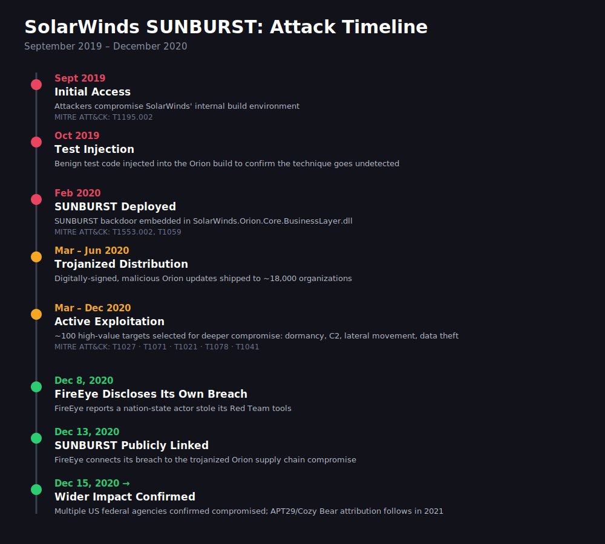
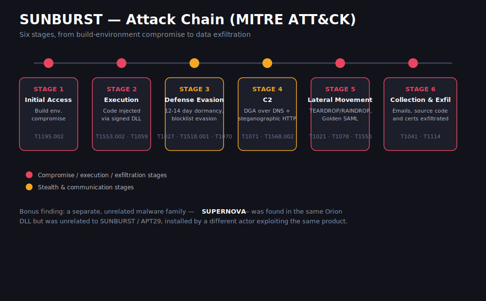

# SolarWinds SUNBURST: Supply Chain Attack Case Study

An in-depth technical case study of the 2020 SolarWinds/SUNBURST supply chain
compromise, one of the most sophisticated nation-state cyber operations ever
documented, covering the full attack lifecycle, its mapping to MITRE ATT&CK,
and the detection failures and lessons it exposed for supply chain security.

## Table of Contents

- [Executive Summary](#executive-summary)
- [Timeline](#timeline)
- [Attack Overview](#attack-overview)
- [MITRE ATT&CK Mapping](#mitre-attck-mapping)
- [Impact](#impact)
- [Lessons Learned](#lessons-learned)
- [Report & References](#report--references)
- [License](#license)

## Executive Summary

In December 2020, security firm FireEye (now Mandiant) uncovered SUNBURST, a
backdoor secretly embedded in digitally-signed updates of SolarWinds' Orion
IT-monitoring platform. Attackers had compromised SolarWinds' internal build
environment as early as September 2019 and used it to trojanize Orion updates
that were subsequently distributed, completely unknowingly, to roughly **18,000
organizations**, including U.S. federal agencies (Treasury, Commerce, Homeland
Security, State, DOJ, parts of the Pentagon) and major technology companies
(Microsoft, Intel, Cisco, Deloitte).

Of those 18,000, the attackers, attributed with high confidence to **APT29
("Cozy Bear")** and linked to Russia's SVR, selected roughly **100 high-value
targets** for deeper compromise: lateral movement, credential theft via a
"Golden SAML" technique, and exfiltration of sensitive data and source code.
The operation went undetected for over **14 months**, largely because the
malicious code arrived through a channel every security tool was designed to
trust, a legitimately signed vendor update.

The central lesson of this case study is that supply chain attacks are an
inherent vulnerability of modern digital ecosystems. Compromising a single
trusted vendor is enough to expose thousands of otherwise well-defended
organizations. Defending against this class of attack requires a shift from
implicit trust in vendors toward continuous verification, transparency, and
shared responsibility across the supply chain.

## Timeline

| Date | Event |
|---|---|
| Sept 2019 | Attackers gain initial access to SolarWinds' build environment |
| Oct 2019 | Trial injection of benign code to test the technique undetected |
| Feb 2020 | SUNBURST backdoor embedded into the Orion build |
| Mar – Jun 2020 | Trojanized, signed Orion updates distributed to ~18,000 customers |
| Mar – Dec 2020 | Active exploitation of ~100 selected high-value targets |
| Dec 8, 2020 | FireEye discloses that it was breached and its Red Team tools stolen |
| Dec 13, 2020 | FireEye publicly links its breach to the Orion supply chain compromise |
| Dec 15, 2020 → | Wider impact confirmed across multiple U.S. federal agencies |

## Attack Overview

SolarWinds Corporation's **Orion** platform, used by roughly 33,000 customers
including government agencies and Fortune 500 companies for network
monitoring, runs with elevated privileges across an organization's servers,
network devices, and applications. That combination of broad market
penetration and high privilege made it an ideal supply chain target.

A structural weakness enabled the initial breach: SolarWinds did not separate
authentication between its IT network and its software development network,
violating the kind of segmentation required by standards like NERC CIP-005-6.
Once inside the development environment, the attackers injected SUNBURST
during the Orion **build process itself**, modifying source before the
compiler read it, so no trace was left in the source repository. Security
researchers at Kaspersky later found code similarities between SUNBURST and
the previously known **Kazuar** backdoor.

### Defense evasion

SUNBURST remained dormant for 12–14 days after installation, disguised its
network traffic as the legitimate "Orion Improvement Program" protocol, and
used obfuscated blocklists to detect and disable forensic tools, antivirus,
and security services running as processes, services, or drivers.

### Command & control

Two channels were used: a **domain generation algorithm (DGA)** built
subdomains of `avsvmcloud[.]com` that encoded the victim's identity, with DNS
responses doubling as a killswitch (specific IP ranges terminated the
malware); and an **HTTP channel** that hid C2 commands via steganography
inside JSON payloads designed to look like legitimate SolarWinds telemetry.

### Lateral movement & credential access

High-value targets received additional tooling: **TEARDROP**, a memory-only
dropper disguised as a JPG file; **RAINDROP**, which delivered a Cobalt Strike
BEACON payload; and, in some cases, theft of an ADFS token-signing certificate
to forge SAML tokens (**"Golden SAML"**), granting access to Azure AD and
Microsoft 365 environments.

### Collection & exfiltration

For the ~100 deep-dive targets, attackers exfiltrated data over the existing
C2 channel, including thousands of emails from the U.S. Departments of
Justice, Treasury, and Homeland Security, and source code/certificates from
Microsoft.

A separate, unrelated piece of malware called **SUPERNOVA** was later found in
the same Orion DLL, installed by a different threat actor exploiting the same
product; it is not part of the SUNBURST/APT29 campaign.

## MITRE ATT&CK Mapping

| Tactic | Technique ID | Technique | Use in This Attack |
|---|---|---|---|
| Initial Access | T1195.002 | Compromise Software Supply Chain | Build process compromise, trojanized Orion updates |
| Execution | T1059 | Command and Scripting Interpreter | Malicious logic executed via a trusted, signed DLL |
| Execution | T1553.002 | Code Signing | Backdoor shipped inside legitimately signed binaries |
| Defense Evasion | T1027 | Obfuscated Files or Information | Obfuscated blocklists, disguised traffic |
| Defense Evasion | T1518.001 | Security Software Discovery | Detection of AV/EDR processes and drivers |
| Defense Evasion | T1070 | Indicator Removal | Log deletion, backdoor removal after access secured |
| Command and Control | T1071.001 / .004 | Application Layer Protocol (Web/DNS) | HTTP + DNS-based C2 |
| Command and Control | T1568.002 | Domain Generation Algorithms | `avsvmcloud[.]com` subdomain generation |
| Command and Control | T1132.001 | Standard Encoding | Steganographic HTTP payloads |
| Lateral Movement | T1021 | Remote Services | Post-compromise movement via TEARDROP/RAINDROP |
| Lateral Movement | T1078 | Valid Accounts | Use of stolen, legitimate credentials |
| Lateral Movement | T1550 | Use Alternate Authentication Material | Golden SAML forged tokens |
| Lateral Movement | T1053 / T1105 | Scheduled Task / Ingress Tool Transfer | Temporary task modification, tool delivery |
| Collection & Exfiltration | T1041 | Exfiltration Over C2 Channel | Data exfiltrated over existing C2 |
| Collection & Exfiltration | T1114 | Email Collection | Government agency mailboxes accessed |

## Impact

- **85%** of surveyed organizations were affected; **31%** reported significant impact
- Average financial cost: **~$12.3M** (≈11% of annual revenue) per affected company
- **91%** of organizations reassessed their supply chain security posture; **42%** implemented immediate improvements
- Regulatory fallout included **Executive Order 14028** (May 2021) on improving national cybersecurity
- Attribution to APT29 was announced jointly by the **FBI, CISA, NSA, and ODNI** in April 2021, but no criminal charges followed, and SolarWinds stated it never independently verified the attackers' identity, underscoring how difficult attribution remains even in well-documented incidents

## Lessons Learned

**Why detection failed for 14 months.** The malware arrived through a channel
every security control was built to trust: a signed vendor update. It
combined that with genuine operational discipline, including dormancy periods,
traffic disguised as legitimate telemetry, and the deliberate use of native
system tools (PowerShell, valid credentials) instead of custom malware once
inside a target network.

**The "solarwinds123" password.** A weak password, publicly exposed on GitHub
for over a year, became a symbol of a deeper cultural problem. Regardless of
whether it was an actual attack vector, SolarWinds' initial response (blaming
an intern) was widely criticized rather than treated as an opportunity for
transparent self-assessment.

**What would have helped.** Detectable signals that were only identified in
hindsight included: outbound HTTP PUT/POST monitoring, scheduled task modification alerts,
PowerShell logging (Event ID 4104), NTFS timestamp anomaly checks, one-to-many
logon pattern analysis, and impossible-travel geolocation checks. Structurally,
proactive threat hunting, SIEM coverage, Active Directory monitoring, and DLP
would have narrowed the window of exposure.

**The bigger picture.** A single trusted vendor's compromise can expose
thousands of otherwise well-secured organizations. No organization is more
secure than the weakest link in its supply chain. Frameworks like Zero Trust
Architecture, continuous verification, and cross-industry threat intelligence
sharing (as recommended by ENISA) are the direction the industry has moved
since. The pattern repeated in the **europa.eu / Trivy compromise
(March 2026)**, exposing data from at least 30 European organizations, which
confirms this remains a live, evolving threat rather than a solved problem.

## Report & References

The full, detailed technical report (originally prepared for a university
Cybersecurity course) is available as a PDF: [`report.pdf`](report.pdf).

Full source list: [`references.md`](references.md).

## License

All Rights Reserved, see [LICENSE](LICENSE). Shared publicly for portfolio
and review purposes; reuse or redistribution requires prior written
permission from the author.
